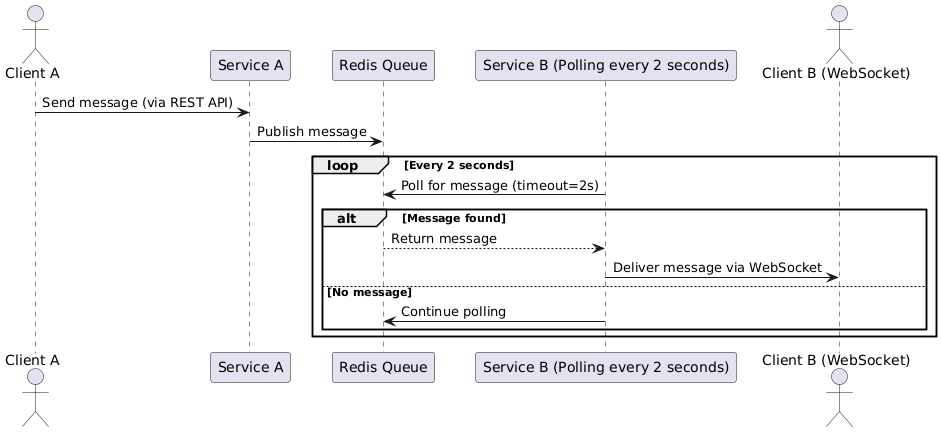

# Asynchronous Message Queue Abstraction Library

## Project Description
This project involves designing an asynchronous message queue abstraction library and demonstrating its functionality with two FastAPI-based microservices. The message queue facilitates communication between microservices, combining REST API and WebSocket for data processing and delivery.

## Tech Stack
- Python
- FastAPI
- Redis
- WebSocket
- Docker, Docker Compose
- pytest

## Key Features
1. **Message Queue Library**
   - Provides functionalities for message publishing, subscribing, and filtering.
   - Includes retry logic for handling failed messages.
2. **FastAPI Microservices**
   - **Service A**: Receives data from Client A via REST API and publishes it to the Redis message queue.
   - **Service B**: Consumes data from the Redis queue via polling and delivers it to Client B via WebSocket.
3. **Integration of REST API and WebSocket**
   - Uses REST API for data ingestion and WebSocket for data delivery.
4. **Polling-Based Data Processing**
   - Checks the Redis queue periodically (every 2 seconds) to process data.
5. **Swagger UI**
   - REST API documentation is accessible via **http://127.0.0.1:8002/docs#/default**.
6. **Testing**
   - Includes unit tests to validate core functionalities, retry logic, and edge cases.

## System Architecture

Below is the system call flow diagram:



## Key Processes
1. **Client A** sends data to **Service A** via REST API.
2. **Service A** receives the data and publishes it to the Redis message queue.
3. **Service B** uses a polling mechanism to consume data from the Redis queue and processes it.
   - Polling is configured with a **2-second interval**.
4. **Service B** delivers the processed data to **Client B** via WebSocket.
5. **Client B** receives the WebSocket messages and processes the results or performs additional actions.

---

## Project Structure
```
asynchronous-message-queue/
├── src/
│   ├── service_a/           # Message publishing service
│   ├── service_b/           # Message polling and WebSocket delivery service
│   ├── message_queue/       # Message queue abstraction library
│   ├── websocket/           # WebSocket-related code
│   ├── utils/               # Utility functions
│   ├── client/              # Client-side code (includes client.py)
├── test/                    # Unit test code
├── requirements.txt         # Python dependencies
├── Dockerfile               # Docker configuration
├── docker-compose.yml       # Docker Compose configuration
```

## Installation and Execution

### 1. Run Redis and Services
Use Docker Compose to run Redis and both services:
```bash
docker-compose up --build
```

### 2. Check REST API
To test Service A’s REST API, use Swagger UI:
- Swagger UI URL: **http://127.0.0.1:8002/docs#/default**
- Use the `POST /messages` endpoint to publish messages.

### 3. Test WebSocket
Run `src/client/client.py` to receive messages from Service B via WebSocket:
```bash
python3 src/client/client.py
```

### 4. Run Unit Tests

Unit tests are provided to validate the core functionalities of the project, including:
- Message publishing and subscribing logic.
- Retry mechanisms for failed messages.
- Edge cases, such as maximum capacity or timeouts.

#### Prerequisites
To run the tests locally, ensure the following dependencies are installed:
1. Install the required Python packages:
   ```bash
   pip install -r requirements.txt
2. The requirements.txt file includes:
- pytest: For running the tests.
- redis: To interact with Redis in the tests.
- pytest-mock: For mocking Redis or other dependencies.

Execute the following command to validate core functionalities and edge cases:
```bash
pytest
```

---

## Testing Instructions

### Load Testing (`test_high_load_publishing_parallel.py`)
- `test_high_load_publishing_parallel.py` is a **load test** for publishing messages in parallel.
- Ensure that the Redis server is running before executing this test.

Run Redis server:
```bash
docker run --name redis -p 6379:6379 -d redis
```

Execute the load test:
```bash
pytest test/test_high_load_publishing_parallel.py
```